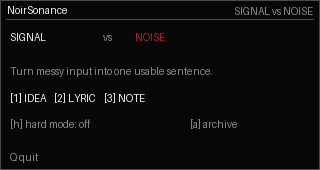
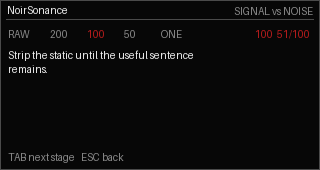

# Signal vs Noise

Offline writing distillation tool for NoirSonance Cardputer Zero and regular
Linux desktops.

This public repository contains install instructions and binary package
downloads. The development source lives in the private/local NoirSonance Gitea
repository.

## Screenshots




## Install

Use the install helper:

```bash
curl -fsSL https://raw.githubusercontent.com/rimedag/signal_vs_noise_cardputerzero/main/install.sh | sh
```

Or download the package for your machine:

```bash
ARCH="$(dpkg --print-architecture)"
curl -LO "https://raw.githubusercontent.com/rimedag/signal_vs_noise_cardputerzero/main/pool/main/s/signal-vs-noise/signal-vs-noise_0.1.0-noirsonance1_${ARCH}.deb"
sudo apt install "./signal-vs-noise_0.1.0-noirsonance1_${ARCH}.deb"
```

## Launch

Cardputer Zero / small display:

```bash
signal-vs-noise-cardputerzero
```

Regular Linux desktop or Raspberry Pi HDMI desktop:

```bash
signal-vs-noise-desktop
```

Automatic mode:

```bash
signal-vs-noise
```

## Packages

Public downloads are architecture-specific binary builds:

- `amd64` for regular Linux desktops and laptops.
- `arm64` for Cardputer Zero and 64-bit Raspberry Pi OS.

The public `.deb` files do not contain the app's readable Python source files.
